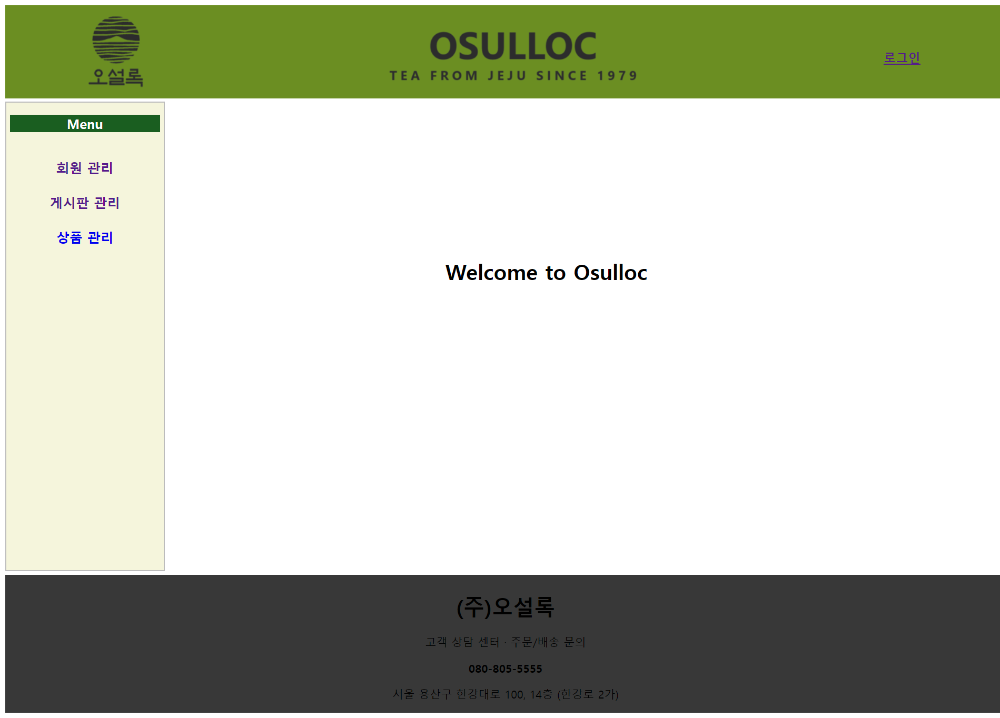
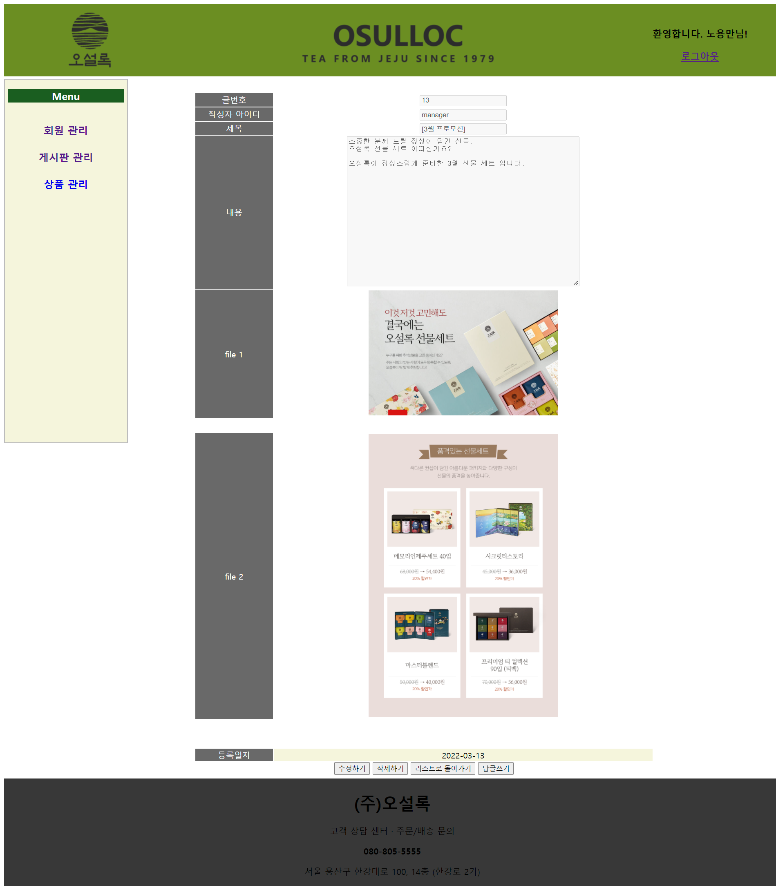
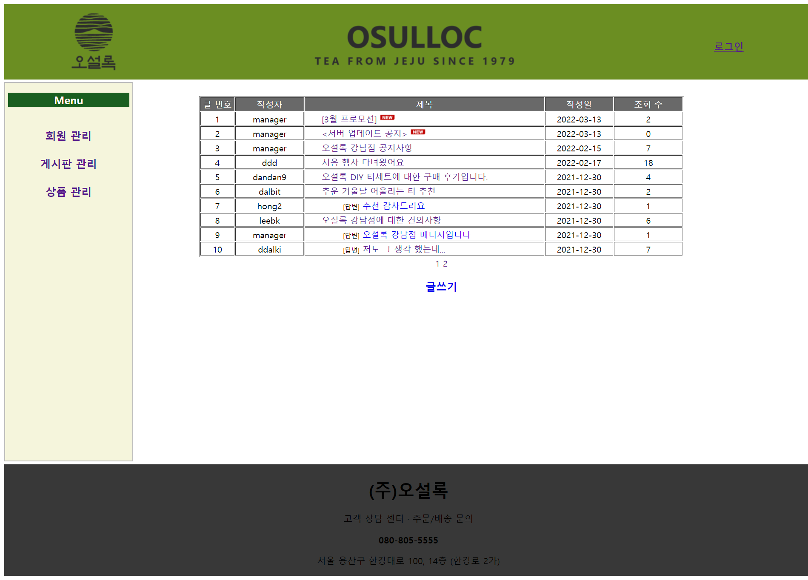
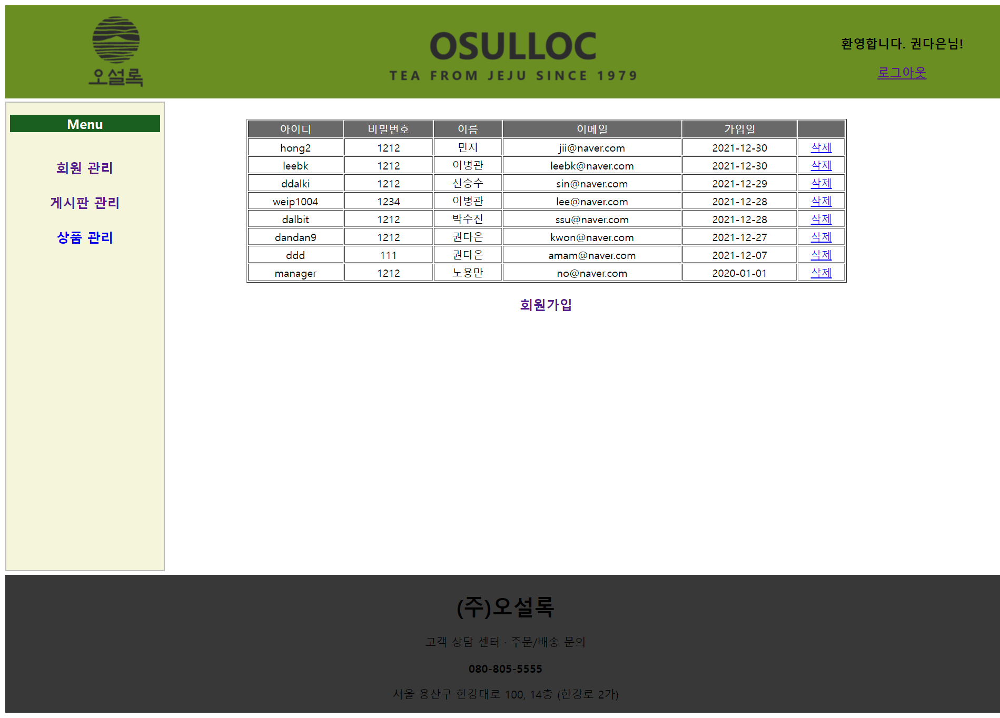
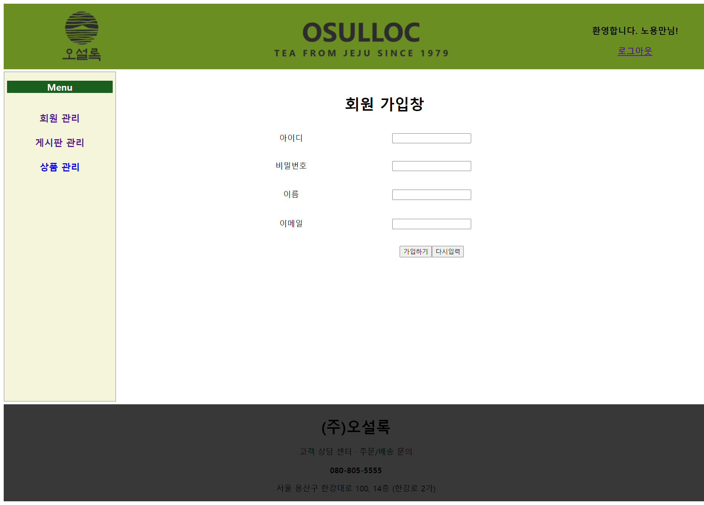
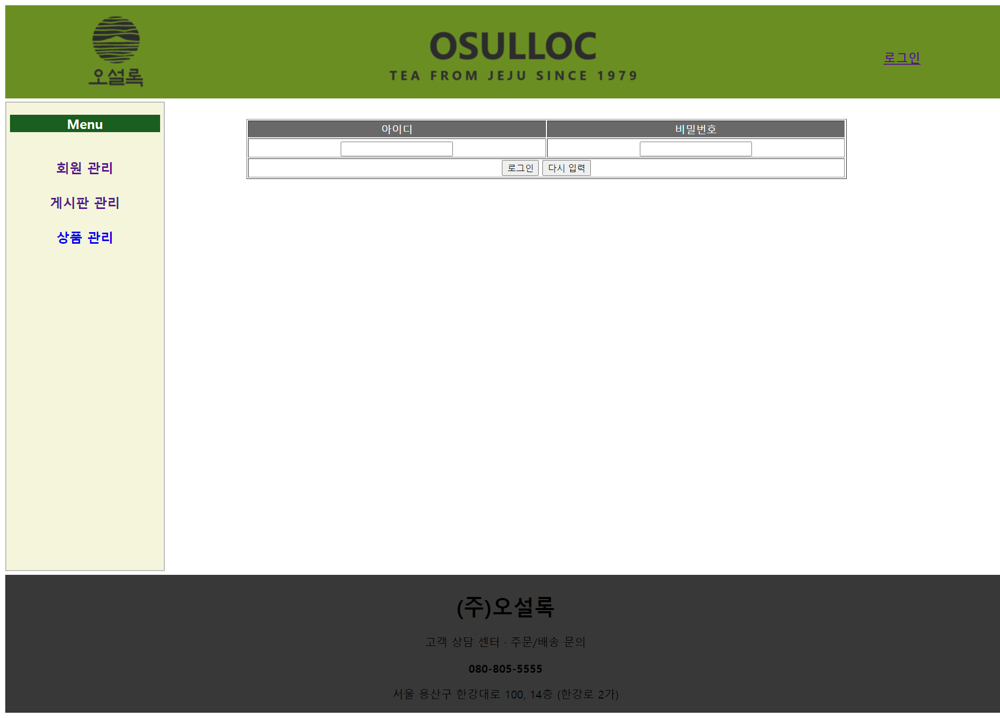

# Board

## Description

JSP와 MyBatis를 이용한 회원관리 및 게시판 구현

* **첫 실행화면**

  
* **게시판 작성 예시**

  
* **게시판 목록**

  
* **회원관리**

  
* **회원가입**

  
* **로그인**


---

## Getting Started

DB Table 생성 후 실행 (*http://localhost:8090/board/main.do* 주소창에 입력)

```sql
create table t_Board(
    recView varchar2(100),
    notice varchar2(10),
    articleNO number(10) primary key,
    parentNO number(10) default 0,
    title varchar2(500) not null,
    content varchar2(4000),
    imageFileName varchar2(30),
    writedate date default sysdate not null ,
    id varchar2(10),
    CONSTRAINT FK_ID FOREIGN KEY(id)
    REFERENCES t_member(id)
);

ALTER TABLE t_board ADD notice varchar2(10) DEFAULT 0 NOT NULL;
ALTER TABLE t_board ADD viewNum number(20) DEFAULT 0 NOT NULL;

    CREATE TABLE t_imageFile (
    imageFileNO number(10) primary key,
    imageFileName varchar2(50),
    regDate date default sysdate,
    articleNO number(10),
    CONSTRAINT FK_ARTICLENO FOREIGN KEY(articleNO)
    REFERENCES t_Board(articleNO) ON DELETE CASCADE
    );
```